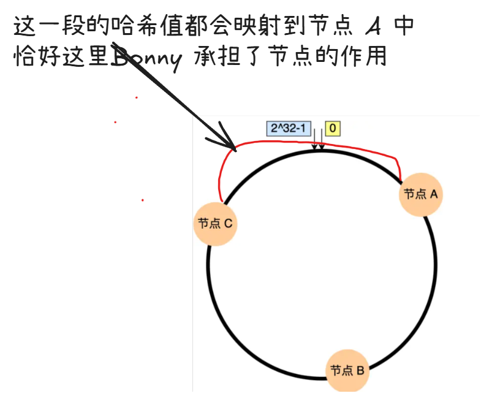

# 为什么没有 erase ?（假设 n 个节点）

- Remove: O(n) 需要遍历并删除多个虚拟节点
- New: O(n log n) 重新添加所有节点并排序

重建节点的开销是可以接受的

# key name and node name

"Ben" 是需要存储/查询的数据的键名

"Bonny" 是存储该数据的节点名

```go

func TestConsisency(t *testing.T) {
	hash1 := New(1, nil)
	hash2 := New(1, nil)

	hash1.Add("Bill", "Bob", "Bonny")
	hash2.Add("Bob", "Bonny", "Bill")

	if hash1.Get("Ben") != hash2.Get("Ben") {
		t.Errorf("Fetching 'Ben' from both hashes should be the same")
	}

	hash2.Add("Backy", "Ben", "Bobby")

	fmt.Println(hash2.Get("Ben"))
    // Bonny
}
```

这里为什么会输出 Bonny ?

节点名 和 键名 是不一样的

为什么要用一致性哈希？

[小林coding](https://xiaolincoding.com/os/8_network_system/hash.html#%E4%BD%BF%E7%94%A8%E5%93%88%E5%B8%8C%E7%AE%97%E6%B3%95%E6%9C%89%E4%BB%80%E4%B9%88%E9%97%AE%E9%A2%98)中讲的很清楚

主要是为了解决扩容和缩容的问题


```go

func TestConsistency(t *testing.T) {
    hash := New(1, nil)
    hash.Add("NodeA", "NodeB", "NodeC")  // 使用更明显的节点名
    
    // 测试多个键的映射
    keys := []string{"Ben", "Alice", "Tom", "Data123"}
    
    for _, key := range keys {
        node := hash.Get(key)
        fmt.Printf("Key '%s' → Node '%s'\n", key, node)
    }
}
```

```shell
➜  consitenthash git:(main) ✗ go test -v
=== RUN   TestHashing
--- PASS: TestHashing (0.00s)
=== RUN   TestConsistency
Key 'Ben' → Node 'NodeA'
Key 'Alice' → Node 'NodeB'
Key 'Tom' → Node 'NodeA'
Key 'Data123' → Node 'NodeA'
--- PASS: TestConsistency (0.00s)
PASS
ok      example.com/gcache/consitenthash        0.004s
```
这个例子可能会更加好一些

一致性哈希的职责只告诉我们去哪里找数据
也就是 get node 然后拿着 get 去找数据
