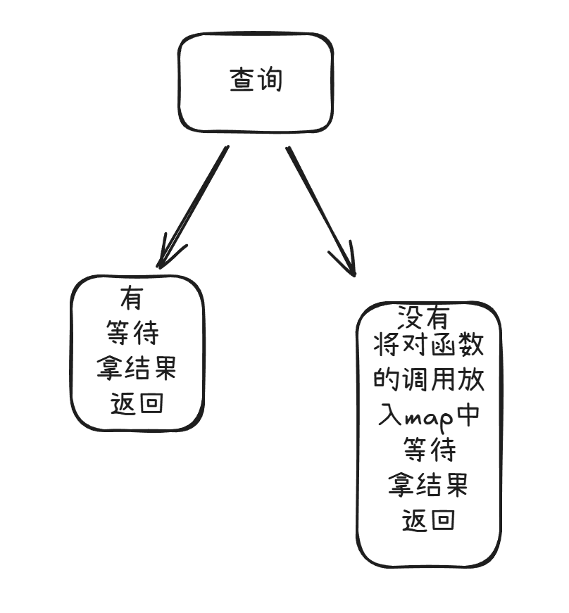

[Deepwiki](https://deepwiki.com/search/cs_3f9896a7-ccb9-46d6-bdd3-92978c457e45) 

无敌大杀器 下巴掉到地上了 :)

如果 mod 环节出错 换代理
```shell
go env -w GOPROXY=https://goproxy.cn,direct
```

# singleflight

先来了解一下什么是 `singleflight`

[demo](singleflight.go)

没有 singleflight：你查一次数据库，同事也查一次数据库 → 查了2次

有 singleflight：你查数据库，同事看到你在查就等着，然后用你的结果 → 只查了1次

call 代表一个函数状态

Group 将对同一个函数的调用聚合在一起



